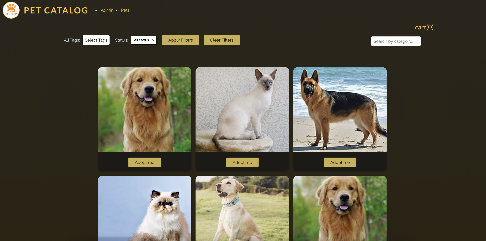
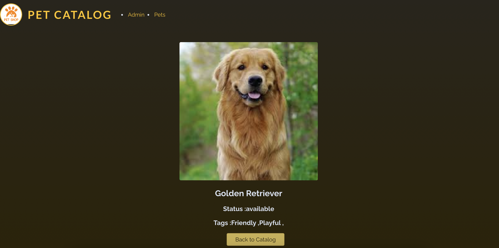
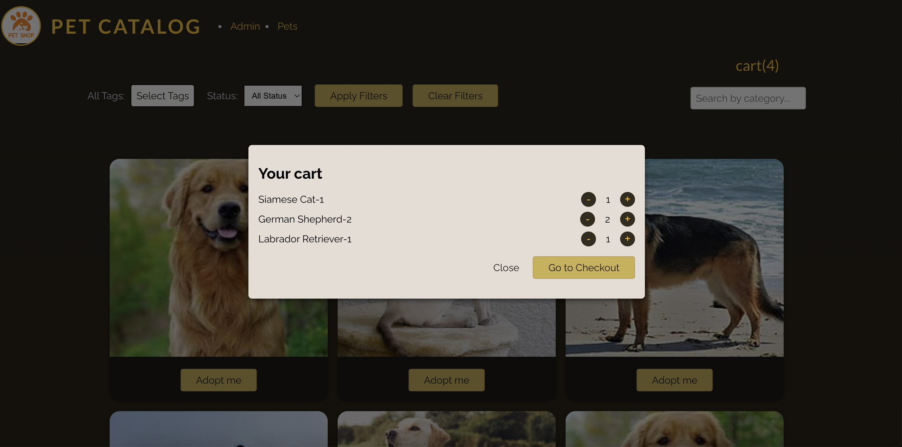
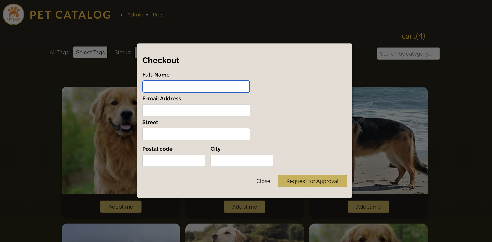

# Pet Catalog

A demo react application for users to find pets ready for adoption. 

## Dashboard
- Page with a list of pets that could be filtered using various tags and availability status


## Pet Details
- Page for displaying the details of a pet


## Cart Details
- Page for displaying the pets selected for adoption


## Checkout Page
- Page to submit request for approval



# Technologies/Features Used

- React v18.2.0 
- React Hooks 
- React Router
- React ContextAPI
- CSS 
- NodeJS v18.13.0

# Project Setup

- Clone the repository
```shell
git clone git@github.com:Staffbase/md-puja_singh.git
```

### Run Backend
> Backend runs on port 3000.

- CD into backend directory
```shell
cd pet-catalog/backend
```

- Install dependencies and run
```shell
npm install && npm start
```

### Run Frontend
CD into the root directory of the project.

- Install dependencies
```
npm intall
```

- Run frontend
```shell
npm start
```

### Run Tests
```shell
npm run test
```

### Run Linter
```shell
npm run lint
```

### Run Formatter
```shell
npm run format
```

## Future Enhancements
- Add a functional Admin dashboard.
- Add user registration and login flow.
- Add user based access control.
- Add more unit tests.

